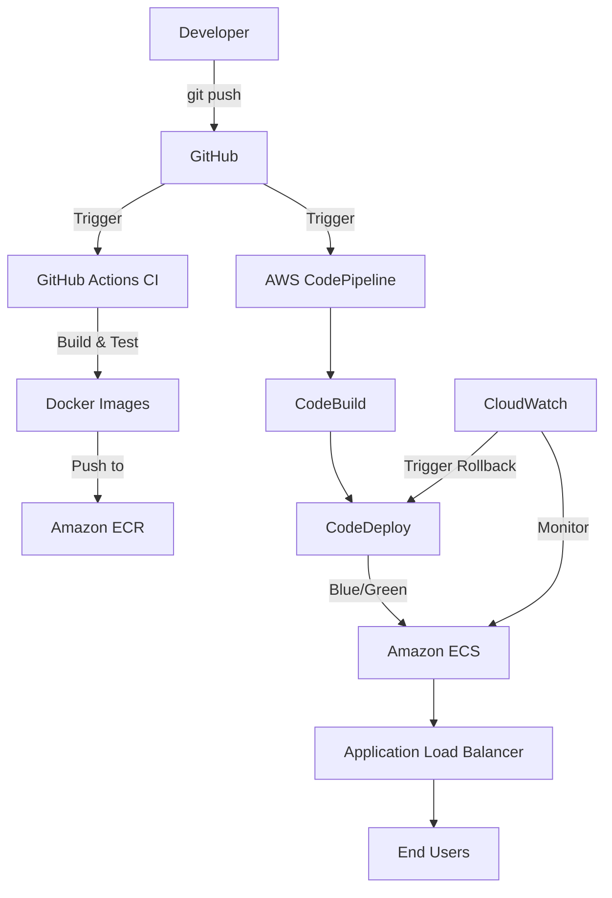

# CI/CD Pipeline with Docker, GitHub Actions & AWS

[](https://github.com/yashbaviskar15/cicd-pipeline/actions/workflows/ci.yml)

## 📋 Project Overview
A complete, production-style CI/CD pipeline demonstration project built for DevOps portfolios. This project showcases modern DevOps practices including Infrastructure as Code, containerization, automated testing, blue/green deployments, and monitoring.

## 🎯 Key Features (For Your CV)

| Feature | Details |
|-----------|---------|
| **Infrastructure as Code (IaC)** | Complete AWS infrastructure provisioned using Terraform |
| **Containerization** | Multi-stage Docker builds for backend/frontend services |
| **CI/CD Pipeline** | GitHub Actions for CI, AWS CodePipeline for deployment |
| **Blue/Green Deployments** | Zero-downtime releases with AWS CodeDeploy |
| **Automated Testing** | Unit tests with Jest & Supertest |
| **Monitoring & Observability** | CloudWatch integration with auto-rollback |
| **Secrets Management** | OIDC authentication (no hard-coded credentials) |
| **Best Practices** | Least-privilege IAM roles, .dockerignore, proper .gitignore |

## 🏗️ Architecture

For detailed architecture, see [docs/architecture.md](docs/architecture.md).



## 🛠️ Tech Stack

- **Backend**: Node.js + Express
- **Frontend**: Static HTML + Nginx
- **Containerization**: Docker
- **Infrastructure as Code**: Terraform
- **CI**: GitHub Actions
- **Container Registry**: Amazon ECR
- **Orchestration**: Amazon ECS (Fargate)
- **Deployment**: AWS CodeDeploy (Blue/Green)
- **Pipeline**: AWS CodePipeline
- **Monitoring**: Amazon CloudWatch
- **Testing**: Jest + Supertest

## 🚀 Getting Started

### Prerequisites

- AWS Account
- GitHub Account
- Docker Desktop installed locally
- Terraform installed locally
- AWS CLI configured

### Local Development

#### Using Docker Compose:

```bash
# Build and start the project
docker compose up -d --build

# View logs
docker compose logs -f

# Stop the project
docker compose down
```

#### On Windows (Using Batch Scripts):

Double-click:
- `build.bat` - Build images
- `start.bat` - Start project
- `stop.bat` - Stop project

#### Local URLs:
- Frontend: http://localhost:8080
- Backend Health: http://localhost:3000/health
- Backend API: http://localhost:3000/api/data

### AWS Deployment

For complete AWS deployment guide, see [docs/aws-setup.md](docs/aws-setup.md).

## 🧪 Testing

### Backend Unit Tests:

```bash
cd backend
npm install
npm test
```

## 📚 Documentation

- [Architecture Overview](docs/architecture.md)
- [AWS Setup Guide](docs/aws-setup.md)
- [Terraform Docs](terraform/README.md)

## 🧹 Cleanup

To avoid AWS costs, destroy the infrastructure when done:

```bash
cd terraform
terraform destroy
```

## 💰 Cost Estimate

| Service | Cost (Free Tier Eligible) |
|---------|---------------------------|
| Amazon ECS | ~$0.01/hour per task (256 CPU / 512 MB) |
| Application Load Balancer | ~$0.025/hour + data transfer |
| Amazon ECR | First 500MB/month free |

## 📄 License

This project is licensed under the MIT License - see the [LICENSE](LICENSE) file for details.

## 👨‍💻 Author

Yash Baviskar 
- GitHub: @yashbaviskar15
- LinkedIn: https://www.linkedin.com/in/yashbaviskar15

## 🌟 Star This Project

If you found this project helpful, please give it a star! ⭐
