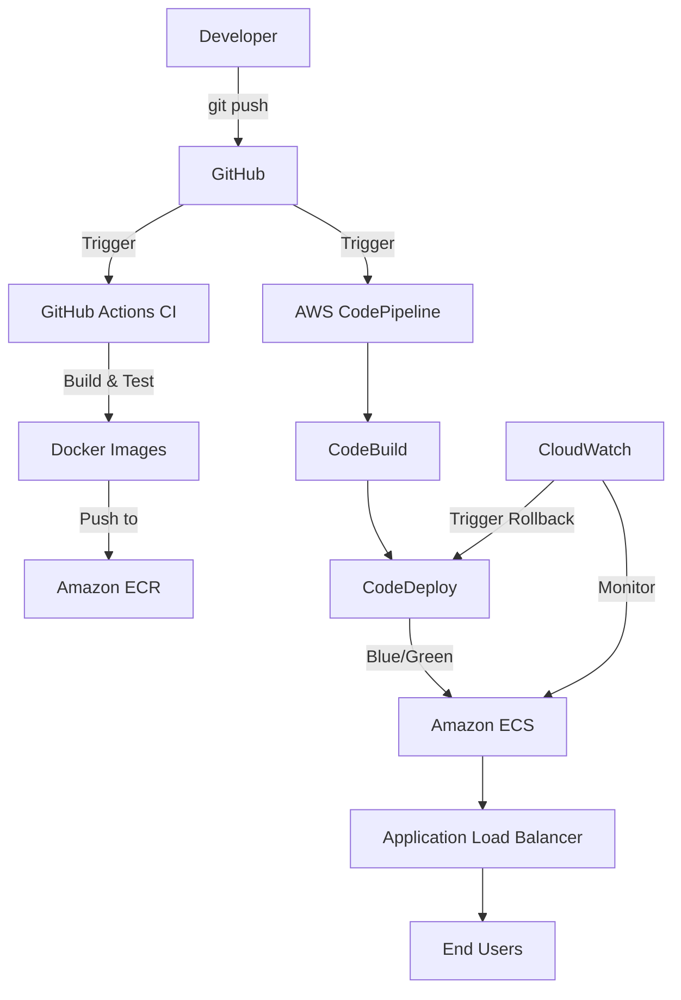

# CI/CD Pipeline with Docker, GitHub Actions & AWS

[](https://github.com/yashbaviskar15/cicd-pipeline/actions/workflows/ci.yml)
[](LICENSE)
[](backend)
[](docker-compose.yml)
[](docs/aws-setup.md)
[](terraform)

A complete, production-style CI/CD pipeline demonstration project built for DevOps portfolios. This project showcases modern DevOps practices including infrastructure as code, containerization, automated testing, blue/green deployments, and monitoring.

---

## Table of Contents

- [Architecture](#architecture)
- [Tech Stack](#tech-stack)
- [Getting Started](#getting-started)
- [Local Development](#local-development)
- [Testing](#testing)
- [Documentation](#documentation)
- [Cost Estimate](#cost-estimate)
- [Cleanup](#cleanup)
- [License](#license)
- [Author](#author)

---

## Architecture

For a detailed breakdown, see [docs/architecture.md](docs/architecture.md).



---

## Tech Stack

| Layer | Technology |
|---|---|
| Backend | Node.js + Express |
| Frontend | Static HTML + Nginx |
| Containerization | Docker |
| Infrastructure as Code | Terraform |
| CI | GitHub Actions |
| Container Registry | Amazon ECR |
| Orchestration | Amazon ECS (Fargate) |
| Deployment | AWS CodeDeploy (Blue/Green) |
| Pipeline | AWS CodePipeline |
| Monitoring | Amazon CloudWatch |
| Testing | Jest + Supertest |

---

## Getting Started

### Prerequisites

- AWS Account
- GitHub Account
- Docker Desktop installed locally
- Terraform installed locally
- AWS CLI configured

---

## Local Development

### Using Docker Compose

```bash
# Build and start the project
docker compose up -d --build

# View logs
docker compose logs -f

# Stop the project
docker compose down
```

### On Windows (Using Batch Scripts)

Double-click to run:

| Script | Purpose |
|---|---|
| `build.bat` | Build images |
| `start.bat` | Start project |
| `stop.bat` | Stop project |

### Local URLs

| Service | URL |
|---|---|
| Frontend | http://localhost:8080 |
| Backend Health | http://localhost:3000/health |
| Backend API | http://localhost:3000/api/data |

### AWS Deployment

For the complete AWS deployment guide, see [docs/aws-setup.md](docs/aws-setup.md).

---

## Testing

### Backend Unit Tests

```bash
cd backend
npm install
npm test
```

---

## Documentation

- [Architecture Overview](docs/architecture.md)
- [AWS Setup Guide](docs/aws-setup.md)
- [Terraform Docs](terraform/README.md)

---

## Cost Estimate

To avoid unexpected AWS charges, review the estimated costs below before deploying.

| Service | Estimated Cost | Free Tier Eligible |
|---|---|---|
| Amazon ECS | ~$0.01/hour per task (256 CPU / 512 MB) | Yes |
| Application Load Balancer | ~$0.025/hour + data transfer | No |
| Amazon ECR | First 500 MB/month free | Yes |

---

## Cleanup

To avoid ongoing AWS costs, destroy the infrastructure when you're done testing.

```bash
cd terraform
terraform destroy
```

---

## License

This project is licensed under the MIT License. See the [LICENSE](LICENSE) file for details.

---

## Author

**Yash Baviskar**

- GitHub: [@yashbaviskar15](https://github.com/yashbaviskar15)
- LinkedIn: [yashbaviskar15](https://www.linkedin.com/in/yashbaviskar15)

---

If you found this project helpful, please consider giving it a star.
