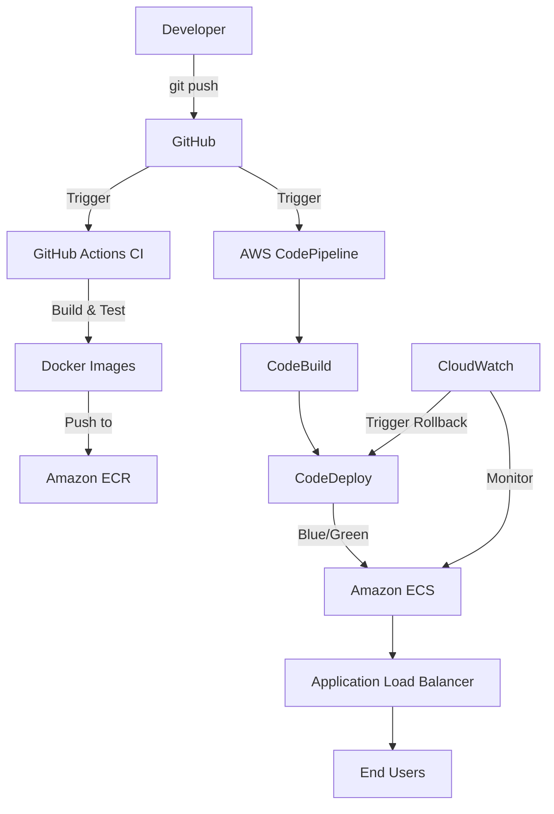

# Project Architecture

## Overview
This is a complete CI/CD pipeline demonstration project using Docker, GitHub Actions, and AWS.

## Architecture Diagram

## Tech Stack
| Component | Technology |
|-----------|------------|
| Backend | Node.js + Express |
| Frontend | Static HTML + Nginx |
| Containerization | Docker |
| Infrastructure as Code | Terraform |
| CI | GitHub Actions |
| Image Registry | Amazon ECR |
| Orchestration | Amazon ECS (Fargate) |
| Deployment | AWS CodeDeploy (Blue/Green) |
| Pipeline | AWS CodePipeline |
| Monitoring | Amazon CloudWatch |

## Key Features
1. **Automated CI/CD Pipeline
2. **Blue/Green Deployments
3. **Infrastructure as Code
4. **Monitoring & Observability
5. **Secrets Management
6. **Auto-Rollback on Failures
